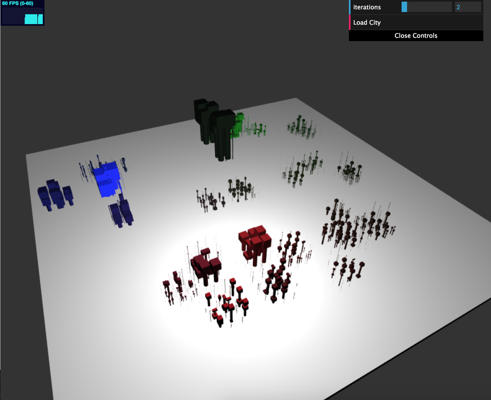
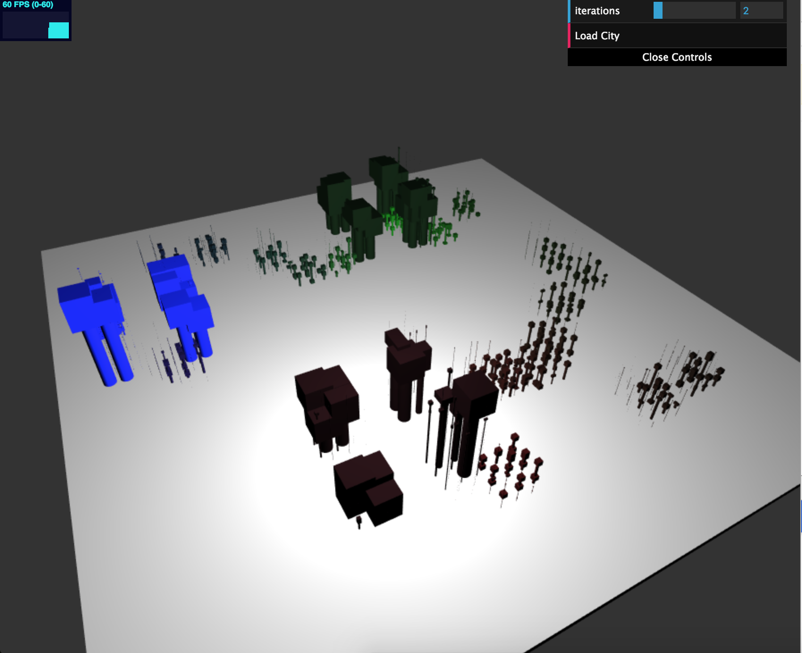

# Project 5: Shape Grammar

https://cis-460-f2017.github.io/homework-5-shape-grammar-city-chloesnyder/ 

## Grammar design for building
- Every building is entirely randomly generated and is subtractive
- Each building starts off with a cube with a given scale
- The initial symbol is "S"
- S -> Subdivide. Divides the cube into 8 smaller cubes. Scales each subdivision down by 1/8th of the parent's scale. Cubes are off set in the x and z direction by .25. Cubes are moved up by a random amount for height variation, and are only moved down if it won't go below 0 (ground plane)
- X - > Scale along x axis by scaling y and z axis down by .5, and not scaling x. This keeps subtractive nature.
- Y -> Scale along y axis by scaling x and z by .5
- Z -> Scale along z axis by scaling x and y by .5
- D -> Delete this shape from the grammar and add nothing to its successors
- For each iteration of parsing a grammar, look at each shape. Based on the shape's symbol, apply a rule. When you are done applying a rule, randomRule() will generate a random rule for the successor shapes. Note that there is an equal chance for each rule to be returned. The successor is determined to be terminal based on whether or not Math.random() > .5. This provides a high level of variation in the buildings
- When the shape grammar has been fully parsed, there is a final round of adding successors. In this case, for each shape in the building, I add a cylinder below it that scales from the bottom of the geometry to the ground plane. This is so that if there are any floating cubes in space, they will be attached to the ground. This also gives a cool futuristic looking, elevated, modern effect. This is my way of adding an interesting decorative feature that is also functional.
- Note that every building is nondeterministic, as every new rule/whether a sucessor shape is terminal is randomly generated. Also note that every rule depends on the position and scale of its parent shape (subdivision depends on parent position/scale, scaling depends on parent scale).

## Grammar design for city
- My city structure is based on the idea of "high population density" areas
- I define 3 high population density areas (HDA). These are fixed areas at  (5, 0, 3), (-6, 0, -2) and (-3, 0, 8). I place buildings at the centers to start, that are scaled betwee 3-5. I also randomly generate 20 other starter buildings that are scaled between 1-2. All seed buildings have symbol "S" to start
- S -> Subdivide a building into 4 smaller buildings by dividing along the x and z axis, offsetting the position by 1/4 the parent scale in the x and z directions. Scale successors down by 1/4 the parent scale.
- X -> subdivide a buidling into 2 smaller buidlings by dividing along the x axis, offsetting psotion by 1/2 the parents scale in the x direction and scaling successors down by 1/2 the parent scale
- Z -> same as X but for the Z axis.
- D -> Delete the building, don't add a sucessor
- Building colors are based on how far a building is from a high population density center. Closer to HDA1 are colored more red, buildings clsoer to HDA2 are colored more green, and buildings closer to HDA3 are more blue.
- Radii of influence are also randomly generated in the constructor of the city. If the distance of the building from a population center falls within any of these radii, then the building is close enough to be considered close to a high population center. This affects the rules in the following ways:
- 1) Buildings close to a high population center are only half as likely to be deleted from the grammar
- 2) When generating a random rule, the random rule is biased towards subdivision. If the building doesn't fall within a radii of influence, there is an equal chance of the generated successor rule being either S, X, Z, or D. If it is within the radii of inflence, there's a 1/2 chance it will return S, and a 1/6th chance of X, Z or D respectively. This means that there tend to be larger buildings closer to population centers (because they are less likely to be deleted), and that there are likely to be more buidlings in these areas (because of more subdivision)
- Every city is entirely randomly generated. As with the building grammar, a random rule is generated for each successor (based on location based biases described above), and whether or not the building is terminal is randomly decided. If we just subdivided by 4, the chance of a successor building being terminal is just 1/3. If we subdivided in either the x or z direction only (2 child buildings), the chance of a successor building being terminal is 1/2;
- Once all buildings positions/scales have been generated, only then do I call "parseShapeGrammar" on the building to actually generate a building instead of just a placeholder cube.
